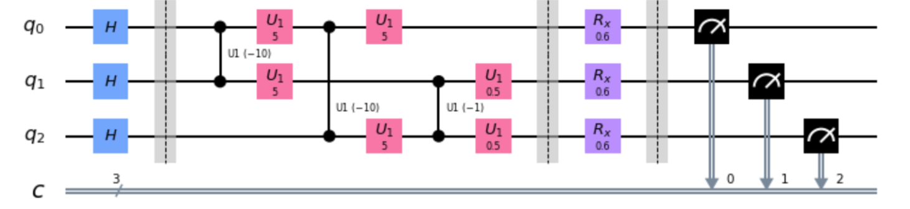
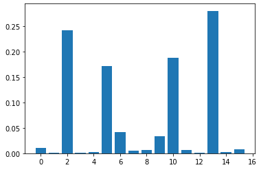
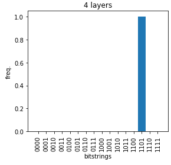
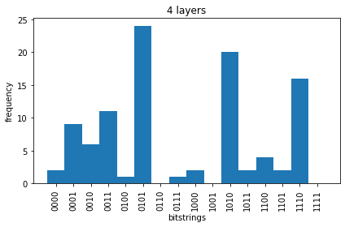
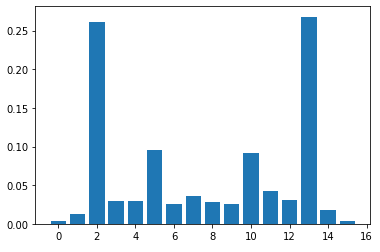

# 12 Notebooks, 11 failures  

*WAIT! Before I get into the story, some housekeeping: The final code I'm submitting is [12-pennylane-final.ipynb](/attempts/12-pennylane-final.ipynb).*  

Picture this: you know nothing about QAOA (beyond it has a cool name some pronounce "kwa-wa") and in less than 48 hours, you're supposed to build a implementation of the algorithm to solve the weighted maxcut problem, generalized to be able to work on any graph.

That's where I was on the morning of Saturday, Feb 20. By Sunday night, I had to submit this code as part of a screening task for [QOSF mentorship](https://qosf.org/qc_mentorship/) applications. The task: Generalize Jack Ceroni's QAOA code to solve the maxcut problems for *weighted* graphs. (For those unfamiliar, [here](problem-statement.md) is the full problem statement.)

My anxiety levels were though the roof. No kidding.

## How I learnt and built QAOA in 2 days
### Saturday Part 1: Pennylane unweighted implementation

On Saturday morning 6AM, I started out with reading the [Pennylane demo](https://pennylane.ai/qml/demos/tutorial_qaoa_maxcut.html). In this demo, the Pennylane dev team demonstrates an implementation of QAOA in Pennylane code to solve an unweighted graph. Alongside Cirq and Qiskit, Pennylane is a python package that you can use to program quantum circuits.

I read through the article and worked out as much math as I could. Once I got a decent intuition for how the algorithm works, I decided to try to program it. 

I didn't want to just copy the code directly from the article into my notebook, because that wouldn't be very helpful for learning. 

Instead, this is what I did:

1. Look through the Pennylane demo code and understand the logic behind what every variable, function, and line of code is doing.
2. Write a plain text summary of the logic behind each code-block.
3. Put away the Pennylane demo code, and start coding my own circuit from scratch. I am only allowed to look at my plain text summary and the mathematical logic section of the article. I am not allowed to look at the Pennylane demo code at all.

This is the first time I tried out this trick. I got the idea a few weeks ago from a friend who uses this to learn machine learning.

Doing this made me realize that I actually understood the code much less well than I thought I did. I wasn't able to get my code to output the correct solution to maxcut. My code had a lot of bugs, and after a morning of debugging, it still didn't work. 

I ended up looking at the Pennylane demo and essentially copying their code. I didn't copy paste, I typed out the code line-by-line in the areas my code didn't work.

This is the code of [1.ipynb](/attempts/1.ipynb) and [2.ipynb](/attempts/2.ipynb).

### Saturday Part 2: Pennylane weighted implementation

It took a whole morning to do that. At around noon, it hit me that I had less than 36 hours to get this weighted maxcut thing to work. Copying code was inefficient, and the code I wrote was still struggling to correctly perform unweighted maxcut. I decided to stop trying to get my own unweighted code to work, and redirect my efforts soley onto try to make weighted maxcut work. Since the problem statement asked us to generalize Jack Ceroni's unweighted maxcut code into weighted maxcut, I figured that if I copy/pasted the Pennylane demo's code and generalized that, it wouldn't be *bad* that I didn't code it from scratch.

So, that's what I did. I copy pasted the code from Pennylane's demo, and tried to generalize it to weighted maxcut. 

I spent the remainder of Saturday afternoon trying to do this. 

I went through 3 different iterations: [3.ipynb](/attempts/3.ipynb), [4.ipynb](/attempts/4.ipynb), and [4.ipynb](/attempts/4.ipynb). And, by the end of Saturday afternoon, I had failed to produce a working QAOA weighted maxcut implementation.

I was trying things out based on my own intuition: By the nature that we're trying to maximize the sum of the weights of the number of cut edges, it made sense to simply multiply the unweighted cost by the weight. An edge with a higher weight being cut would increase our "score" more than an edge with a lower weight.

I essentially multiplied the weighted cost of each edge by the weight. And when that didn't work, I had no idea what else to do.

This moment in time was the lowest point along this journey. I felt so demotivated. I wanted to give up. I had just spent a day without any results or even a sign of progress. I saw no point in trying because I would most likely fail. Who did I think I was, someone who is able to learn QAOA in 2 days?

I replayed the situation of not submitting the QOSF application in my head. After all, ~470 out of 750 applicants last round didn't submit their screening task. No one would miss me.

I don't know why I kept going, but I did.

### Sunday Part 1: Exploring

I decided to take another concept from machine learning: allocating some time to both exploitation and exploration. On Saturday, I was full on exploiting — spending the whole day on debugging and writing code. On Saturday, I didn't think it would be worth the time to do exploration because I was on such a time crunch.

On Sunday morning, I decided to try some exploration. I printed out and read a few articles on QAOA to try to get some inspiration or to possibly find some holes in my logic. And that's when I stumbled on this picture from the Musty Thoughts blogpost: 



The CNOT gate of the cost unitary had weights attached? 

Previously, the only code modification I made to change unweighted → weighted was: modifying the cost function to include the weights of each edge. So I supposed this one change wasn't enough, and instead I needed to modify the cost unitary in some way.

### Sunday Part 2: Abandoning Pennylane for a Cirq weighted maxcut implementation

Another thing I did during exploration was read through Jack's blog post and code. It's crazy that I didn't even look at Jack's code before Sunday morning! I was so sick of debugging Pennylane that I wanted a switch-up. I abandoned my old Pennylane code and copy pasted Jack's code onto a notebook. 

It worked, just as expected.

Now, for the modifications. Firstly, I still switched up the cost function to include the weight. 

Secondly, I modified the cost unitary. The only number I could tweak in the cost unitary was the input to the ZZPowGate. I blindly multiplied that input by the weight, as a best guess. I didn't know what else I could possibly do.

I ran the code again on a weighted graph and...

it worked!

Sort-of.



This plot was the output. The correct answers, 1101 and 0010, were the ones with the highest probability. But a few non-correct answers were pretty close behind.

This is the code of [6-cirq-final.ipynb](/attempts/6-cirq-final.ipynb)

At this time, it was 11:30 AM on Sunday. I was exhausted. I took a break for an hour and a half to eat lunch.

(Note: I a few hours later, I did realize what went wrong with the above plot. It was the "[lazy cost function](#some-interesting-insights)". This problem is now fixed and the notebook works well now :))

### Sunday Part 3: Back to Pennylane

After lunch, I thought about this project holistically. I set a personal goal for this task to "re-implement" Jack's code into Pennylane. Even though the code in Cirq had worked decently, I didn't want to merely submit Jack's code with a few tweaks. It felt cheap, and although it was allowed, it didn't vibe well with my conscience. 

I thought it would be easy to build the weighted maxcut Pennylane implementation: I already had working non-weighted maxcut Pennylane code from the demo on their website, as well as working weighted code from Cirq to base the circuit architecture off of. It would just be a quick tweak of a few lines of code, and all done, right?  

Wrong. 6+ hours later, my code still doesn't work 🤦‍♂️   

To understand why, recap where I was at 11:30 AM, Sunday Febrary 21.  

I had just figured out how to generalize an unweighted maxcut circuit into a weighted one. It was quite easy: I had to tweak Jack's code in what comes down to 3 locations:  
1. Change the cost function to take weights into account. I multiplied the unweighted cost by the weight.
2. Change the cost unitary matrix - multiply the exponent of the Cirq ZZPowGate by the weight
3. Change the input graph into a weighted one

(This is the code of [6-cirq-final.ipynb](/attempts/6-cirq-final.ipynb))


This was before I had really looked at anyone else's weighted implementations in practice, so I based it off of my understanding of the theory. By nature that we're trying to maximize the sum of the weights of the number of cut edges, it made sense to simply multiply the unweighted cost by the weight.

In Jack Ceroni's code, for the cost hamiltonian, one gate he uses is `cirq.ZZPowGate(exponent= -1*math.pi).on(qubits[i.start_node], qubits[i.end_node])`

The ZZPowGate didn't exist in Pennylane, so I looked at the Cirq docs to find out what it meant. What the gate does: it takes the tensor product (or also known as the kronecker product) of two Pauli-Z matrices, and raises it to the power of a parameter you input (in this case `exponent= -1*math.pi`). This is done because each edge has 2 vertices and each vertex is a qubit, therefore we need to take the expected value of 2 qubits in the Z basis, hence the tensor product of two Z matrices.

Then, I built the gate into Pennylane myself using `qml.Hermitian()`. `qml.Hermitian()` essentially is used to put any unitary matrix you defined as a gate onto your circuit.

Before ZZPowGate-ing, the OG Pennylane cost unitary was:

```python
def U_C(gamma):
    for edge in graph:
        wire1 = edge[0]
        wire2 = edge[1]
        qml.CNOT(wires=[wire1, wire2])
        qml.RZ(gamma, wires=wire2)
        qml.CNOT(wires=[wire1, wire2])
```

Now, the new cost unitary with the weights:

```python
def U_C(gamma):
    for edge in graph:
        start_node = edge[0]
        end_node = edge[1]
        weight = edge[2]
        
        # Define the Pauli-Z matrix. This is because we want to find the expected value of each edge pseudo-measured in the Z basis.
        pauli_z = [[1, 0], [0, -1]] 
        pauli_z_2 = np.kron(pauli_z, pauli_z) 
        
        # The unitary gate that will be applied to our circuit
        cost_unitary = scipy.linalg.fractional_matrix_power(pauli_z_2, -1*gamma/np.pi) 
        
        # Note: wires = qubits. Here we are applying the unitary matrix we defined onto the 2 vertices of our edge.
        qml.Hermitian(cost_unitary, wires=[start_node, end_node]) 
```

Here's where the first major problem came in. Jack's code's structure is set up like this: the quantum circuit outputs the measurement in the computational basis, then we fire 100 shots at the circuit to find the probability distribution of the measured states. In Pennylane, the root **circuit directly outputs the expected value**.

In order to use `qml.Hermitian()`, I had to change the Pennylane circuit to also output a computational basis measurement.

Then, I had to write extra fucntions to fire multiple shots and take the average. I couldn't re-use the Cirq functions here, because Pennylane's computational basis measurement outputs some weird tensor arrays, which is different from what Cirq's outputs. (FYI, I spent a good bulk of that 5 hours debugging this output.)

So... I spent a decent chunk of my Sunday afternoon on this task. I spent about 5 hours *just changing the circuit structure.*

Now, after talking to a friend Avneesh, I found out that I didn't actually have to ZZPowGate the Pennylane circuit. I could've just multiplied the gamma from the original cost hamiltonian by the weight 🤦‍♂️ 

Like this:

```python
def U_C(gamma):
    for edge in graph:
        wire1 = edge[0]
        wire2 = edge[1]
        weight = edge[2]
        qml.CNOT(wires=[wire1, wire2])
        qml.RZ(gamma*weight, wires=wire2)
        qml.CNOT(wires=[wire1, wire2])
```

5 hours re-engineering the structure of my code, writing functions to convert decimal strings into binary, were all useless. All I needed to do was to add 7 characters `*weight`.

Anyway, it's there now. You can see it in [12-pennylane-final.ipynb](/attempts/12-pennylane-final.ipynb)

Now, armed with this new insight, I updated my code and re-trained the Pennylane circuit. 

How did it do?



AGHHHHHHHHHHHHHHHHHHHHHHH

I had no idea what went wrong at this point, so I left it at that. Instead of spending time to fix it, I thought I'd write about the process in the readme to make my failure more of a growing experience. That is what you're reading right now.

### Post-submission

3 days later, I found the error. It was such a trivial error with how I called the list variables. My circuit actually outputted the correct result previously. More details [here](change-log/02-24-histograms.md).

The Pennylane code works now :)



Yup, this is 3 days after the QOSF submission deadline. Don't know if it counts. If not, [11.ipynb](attempts/11.ipynb) is unmodified after Sunday except for fixing one typo.

## A few more problems
* The cost function doesn't steadily go down >:(

E.g. the recent run:
```
Cost: -10.916000000000015
Cost: -10.687000000000022
Cost: -10.945000000000016
Cost: -11.083000000000016
Cost: -11.219000000000017
Cost: -10.992000000000017
Cost: -11.205000000000018
Cost: -11.017000000000014
Cost: -10.956000000000017
Cost: -10.979000000000019
```

It goes from 10 to 11 to 10 to 11 and back to 10 again. Sometimes, the cost output looks more like a random number generator than a cost function output. I tried with a few Pennylane optimizers and COBYLA and this always happens. Maybe it's escaping local minima. Not completely sure.

Earlier in the same run:
```
Cost: -7.688000000000008
Cost: -8.166000000000006
Cost: -9.16000000000002
Cost: -8.71300000000002
Cost: -7.425000000000009
Cost: -8.558000000000016
Cost: -8.510000000000016
Cost: -8.953000000000024
Cost: -8.723000000000013
Cost: -8.32500000000001
Cost: -8.363000000000016
Cost: -7.471000000000012
Cost: -6.744000000000003
Cost: -8.450000000000012
```

It's at -9, but then goes to *-6*. The cost *increases* by a significant amount.

* The correct answers have the highest frequency, but a few others are pretty close behind:

Maybe I should experiment with more layers.

* My final code takes ~3-5 mins to train. Compared to the Cirq code based off of Jack's [6-cirq-final.ipynb](/attempts/6-cirq-final.ipynb) which takes less than 10 seconds to train.

## Some interesting insights

I used what I dubbed a "lazy cost function" for a good chunk of my QAOA time: `weighted_cost = unweighted_cost * weight`

It does not output the correct cost, but nevertheless it still works on Cirq... kind of. The lazy cost function outputs the correct answer but with less certainty: 


Compared to the legit cost function: 



I found this interesting. I'm curious to know why. I want to work through this math.

## Reflections
* I realized that all the content from 8.ipynb got deleted somehow. I'm positive I spammed ctrl+s in the Jupyter Notebook editor 10 times before closing, but... oh well. There goes the notebook I spent 5 hours debugging and 2 hours making the comments/structure perfect. This might be why I always feel tense and experience anxiety while coding -- I have no trust that my files will stay or that the same code will run the same way when I run it a second time. Yes, my brain knows that code is 100% logic based, but my feelings don't. For this, I might just need to understand backend OS elements better.
* Why did I spend a few hours writing this? Why did I upload all my failed attempts? I don't know. I want a record of the effort I put in. While coding, it was so hard so hard so hard and lots of pain pain pain pain pain staring at a screen of bugs for a whole afternoon makes your head hurt BUT looking at the repository, you don't see that. Looking at the final polished result, you don't see the pain. Even as I look back, I am no longer feeling the pain. This is a recurring theme amongst basically every project I complete: as soon as I hit publish, I forget the pain I experienced. I forget the hard work. I want to remember it. I want to document my experience. I think maybe writing this was more for me than for anyone else. ... or maybe I wrote this because I wanted the evaluators of this repo to see that although I failed, I put in a ton of work.
* Shoot maybe admitting what I admitted in the last bullet point is too much. Yea, authenticity is great, but... maybe being too authentic isn't so great. Not writing about your selfish intentions publically might be beter.
* As of 8pm Sunday night, the notebooks are pretty messy. I started writing my own code starting from 8.ipynb. I spent a good first hour trying to make all my variables "politically correct", having a space for all user inputs in one place, wanting to explain how the algorithm works in every line of code. But after a while, I pivoted to focusing on making the code logic work before improving its presentation. Now... 11 is filled with comments from debugging. 10:27 PM: I have updated notebook 11. It's no longer filled with comments from debugging. But 6 and all the others still are.

## Time spent: 
* Feb 20 6AM-9AM
* Feb 20 12:30PM-2:30PM
* Feb 20 7PM-10PM
* Feb 21 6AM-9AM
* Feb 21 10AM-11:30AM
* Feb 21 1PM-5:40PM
* Feb 21 6:30PM-10:30PM  

**Total time spent:  ~17 hours**

All of this effort was for this one measly lil notebook...

## [Go check it out!!](attempts/12-pennylane-final.ipynb)

