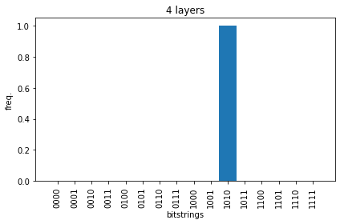

# Histograms

## Sunday night
These are the types of histograms my circuit is generating in 11.ipynb:




I got 1/2 of the correct answer, at least! *Similing through the pain*

Future: debug this code and see what's up. I estimate that doing such a task would take at least an hour, likely more (remember the 5 hours switching a single cost unitary matrix? That was because I was debugging the output of `qml.Hermitian(np.diag(range(2 ** n_wires)), wires=wires)`. So instead, I'm using an hour to write up this account of my experience. 

I estimate that it's because I'm measuring a single state instead of sampling from multiple states. It sure looks like it. However, the `get_counts(optimal_params_vector)` function I am executing to generate this plot is indeed firing 100 shots... so I have no clue what's up.

## Wednesday morning
3 days later, I fixed the error.

Looking back, it should've been obvious that this is because I was sampling only one measurement instead of the 100 shots I thought I was sampling. But at that time, somehow my instinctive reaction was *my circuit gets only one out of the two correct results, but my circuit is absolutely perfect and gets the right result every time!!*

Here was the code for post-optimization data processing and plotting code:

```python
optimal_params = out['x'] # This outputs a 2x4 array not a 1x8 
optimal_params_vector = []
for layer in range(len(optimal_params[0])): # Convert the 1x8 array into a 2x4 array
    optimal_params_vector.append(optimal_params[0][layer])
    optimal_params_vector.append(optimal_params[1][layer]) # optimal_params_vector is good
    
# optimal_params_vector is an array not a tensor 
final_bitstring = get_counts(optimal_params_vector)[1]

binary_bit_string = ''
for bit in decimal_to_binary(final_bitstring[2]): # This for loop gets the string version of the array binary_bit_string
        binary_bit_string += str(bit)

print(f'The answer to our weighted maxcut is: {final_bitstring[2]} or {binary_bit_string}')

import matplotlib.pyplot as plt

xticks = range(0, 16)
xtick_labels = list(map(lambda x: format(x, "04b"), xticks))
bins = np.arange(0, 17) - 0.5

plt.title("4 layers")
plt.xlabel("bitstrings")
plt.ylabel("freq.")
plt.xticks(xticks, xtick_labels, rotation="vertical")
plt.hist(final_bitstring[1], bins=bins)

plt.tight_layout()
plt.show()
```

The problem is basically that when executing the function `final_bitstring = get_counts(optimal_params_vector)[1]`, I already made it output the 2nd element of the output of the function (the 2nd element being the list of 100 bitstrings). Later, when plotting the data `plt.hist(final_bitstring[1], bins=bins)`, I took 2nd element of the list again. However, the variable 'final_bitstring' represented the list the 100 samples, so taking the 2nd element of the list just took the result of the 2nd measurement.

Or, to explain the problem in a more high level way, the function `get_counts()` returns a list of 3 elements. I wanted the 2nd element. The mistake was taking the list element twice. I added '[1]' to the end of the same variable on two separate instances. 

To fix the problem, I just removed '[1]' from the first time I put it. Now, I'm getting the expected distribution in my plots:


The code with the error is [11.ipynb](../attempts/11.ipynb)

The corrected code is [12-pennylane-final.ipynb](../attempts/12-pennylane-final.ipynb). 


---


While writing this, I just realized how often I mixed up the words "array" and "list" when describing these python objects. Shoot. Maybe I'll go through the notebook and revise all my comments to account for that.

---

## Changes to the readme file following this change in code:
* Previouly, I wrote a disclaimer at the beginning of my readme:
> *WAIT! Before I get into the story, some housekeeping: The final code I'm submitting is [11.ipynb](/attempts/11.ipynb). This is an implementation in Pennylane that I coded essentially from the ground up. The code in said notebook isn't perfect and the result is not always correct, from reasons you'll see later, but I choose to submit it anyway. I do, however, want to let you know that I have a working implementation of QAOA weighted maxcut in the notebook [6-cirq-final.ipynb](/attempts/6-cirq-final.ipynb) - the code there is based off of Jack's code and is much faster than the code I wrote.*

NOW I CAN DELETE IT BECAUSE MY CODE WORKS!!!!!!!!!!!!!!!!!!!!!!!


You know what, I'm not even going to write 
> The code in said notebook is not perfect, for reasons you'll see soon, but I choose to submit it anyway. [6-cirq-final.ipynb](/attempts/6-cirq-final.ipynb) also does the job. The code there is based off of Jack's code and is much faster than the code I wrote.

there's no point in highlighting that my code is not perfect.
